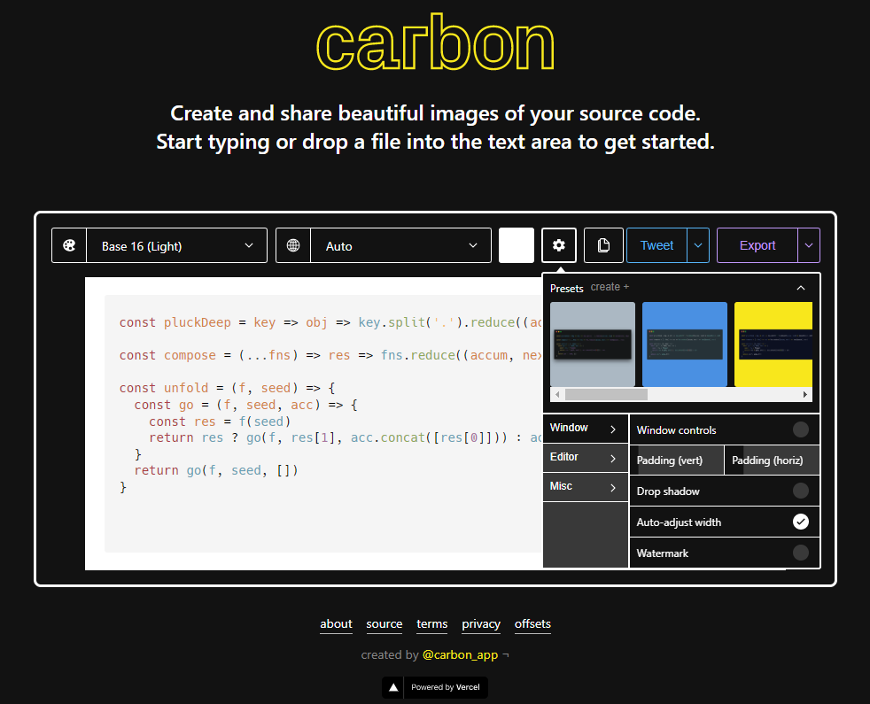

A la hora de generar imagenes de código para articulos, presentaciones, problemas de prueba etc. una captura de pantalla deja pocas opciones a la hora de hacer compatible con la estetica del documento en donde se utiliza la imagen.
Con [Carbon](https://carbon.now.sh/) solo hay que copiar el código del que se quiere sacar la captura y con eso es suficiente para generar una imagen en PNG o SVG. Y en el caso de que se quiera configurar de alguna forma especial, estan las opciones disponibles en el "engrane".

